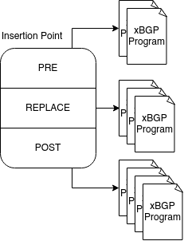

=====================
Structure of a plugin
=====================

A plugin is a set of xBGP program written in C. Several example of xBGP programs can be
found on the directory of this repository.

Let's start with a simple one located in ``monitoring/as_path_count.c``. This plugin
composed from a single xBGP program and just counts the number of AS number contained
in any BGP update message.

.. code-block:: c

    #include "../xbgp_compliant_api/xbgp_plugin_api.h"
    #include "../prove_stuffs/prove.h"
    #include <string.h>

    #define max_bgp_msg UINT16_MAX

    /* (min =  2 bytes for header + 4 bytes one AS) */
    #define MIN_SEGMENT_SIZE 6

    unsigned int __always_inline count_nb_as(const unsigned char *const as_path, unsigned int max_len) {
        unsigned int i = 0;
        unsigned char segment_length;
        unsigned int nb_as = 0;
        unsigned int tmp;

        if (max_len > max_bgp_msg) return -1;
        if (max_len < MIN_SEGMENT_SIZE) return -1; /*1771bis 4.3b: seg length contains one or more AS */

        if (max_len % 2) return -1;

        unsigned int j = 0; // dummy variable that helps T2 to prove the termination

        while (i < max_len && j < max_len) {
            if (max_len - i <= 2) return UINT32_MAX;

            // if the as_path buffer contains erroneous data,
            // "j" helps to prevent infinite loop by incrementing
            // j by MIN_SEGMENT_SIZE, by eventually leaving the loop
            j += MIN_SEGMENT_SIZE;

            segment_length = as_path[i + 1];
            nb_as += segment_length;

            tmp = (segment_length * 4) + 2;

            if ((((tmp + i) > max_len)
                 || (segment_length <= 0)) != 0)
                return UINT32_MAX;

            i += tmp;
        }

        return nb_as;
    }

    uint64_t count_as_path(args_t *args UNUSED) {
        unsigned int as_number = 0;
        unsigned int *attribute_code = get_arg(ARG_CODE);
        unsigned int *as_path_len = get_arg(ARG_LENGTH);
        unsigned char *as_path = get_arg(ARG_DATA);

        if (!as_path || !as_path_len || !attribute_code) {
            // unable to fetch data from host implementation
            return EXIT_FAILURE;
        } else if (*attribute_code != AS_PATH_ATTR_ID) {
            return EXIT_FAILURE;
        }

        // core part of the plugin
        as_number = count_nb_as(as_path, *as_path_len);

        if (as_number == UINT32_MAX) return EXIT_FAILURE;

        // log the message. If it fails, returns error code
        if (log_msg(L_INFO "as_count:%d\n", LOG_UINT(as_number)) != 0) {
            return EXIT_FAILURE;
        }

        return EXIT_SUCCESS;
    }

Each xBGP program only contain one function which will be the entry point used by the
xBGP implementation. The main function will always have the following definition :

``uint64_t function_name(args_t *args);``

The entry point of every xBGP program takes a pointer to a structure ``args_t *``
and **always** return a 64 bits unsigned integer. The function's name is arbitrary
and cna take whatever you want.

While reading the C code, you may notice that we also have another function ``count_as_number``
that contains a special flag, ``__always_inline``, telling to the compiler to not treat
it like a function. This allows the body of the inlined function to be extended to the
place where it was called

Let's go back to our main function ``count_as_path``,
the xBGP program retrieves its arguments through an API call ``get_arg``. The API function
take as argument the type of argument the xBGP would retrieve. Since xBGP programs are
attached to specific insertion points, it can only retrieves the arguments accessible
through the insertion point. More information about the arguments that can be accessed
from insertion point is described in Section...

Once the arguments have been retrieved, the xBGP program can do its computation
to count the number of ASN contained in the AS-PATH. Finally, the program log this
information thanks another function call ``log_msg``.

Integrating a plugin to the xBGP implementation
===============================================

Once all the xBGP program associated to the plugin is written, it must be loaded to the
BGP implementation.

libxBGP provides to the network operator a way to statically load their plugins at BGP boot time.
All the plugins will be then added to a json manifest having the following form :

.. code-block:: json

    {
      "jit_all": true,
      "plugins": {
        "as_log": {
          "extra_mem": 4096,
          "shared_mem": 0,
          "obj_code_list": {
            "count_asn": {
              "obj": "as_path_count.o",
              "jit": true,
              "permissions": [
                "read",
                "write",
                "usr_ptr"
              ]
            }
          }
        }
      },
      "insertion_points": {
        "bgp_decode_attr": {
          "replace": {
            "0": "as_log"
          }
        }
      }
    }

This json is composed in three major parts:

1. General configuration
2. Defining plugin
3. Insertion points

General configuration
---------------------

There are some configuration values that can influence the xBGP configuration
in a global way. For example, in the json described before,
the key "jit-all" is used to inform the xBGP implementation to not interpret xBGP
programs. Instead, it will compile the xBGP program to machine code directly
understandable by the machine's CPU xBGP is run.

Plugin part
-----------

The key "plugins" defined at the top level of the json
is a dictionary of plugins. This is inside this value
that you can define your own plugin to be loaded inside
the BGP implementation.

.. code-block:: json

    "plugins" : {
       // define here your plugins
       "plugin1" : { /* plugin configuration */},
       ...
       "pluginN" : { /* plugin configuration */ }
    }

Each plugin has a name as the key and takes a dictionary
as value. This is inside this dictionary you can
configure the plugin. For example, we name
the plugin that count the AS inside an update message
``as_log``.

The list below are the configuration values you can
adapt according to the need of the plugin.

``extra_mem``: sometimes, the plugin needs extra memory to store
their intermediate results. Use this value to increase the total
memory available memory (**in bytes**) for the plugin.
Warning this memory is automatically freed when an xBGP program
terminates its execution.

``shared_mem``: some plugin may want to have persistent data across
xBGP program calls. Other plugins would share data between several
xBGP programs of the same plugin. This value is then used to reserve
a shared memory for those purposes. Like ``extra_mem`` the value
associated for the shared memory is expressed in **bytes**.

``obj_code_list``: as mentioned before, a plugin is a set of xBGP
programs. This is though this value you will declare all the xBGP
programs associated to the plugin. This field take a dictionary as
value.

.. code-block:: json

    "obj_code_list": {
        "xBGP program 1": { /* xBGP program configuration */ }
        ...
        "xBGP program N": { /* xBGP program configuration */ }
    }

Like plugins, the ``obj_code_list`` contains all the xBGP program
in the form of a dictionary.

The field you can change for a xBGP program are listed below:

``obj``: an xBGP program is associated to one ELF file containing the
actual eBPF bytecode te be executed in the BGP implementation.
This field **must only** mention the file name and not it path to the
filesystem. By default, the BGP implementation look at a folder when
BGP is compiled. However, if you would still change the default folder,
it must be indicated in the general config part of the JSON manifest.

``jit``: if set to True, the xBGP program will be compiled to the
machine code of the machine. However, it will be interpreted. By default,
the code is not compiled for debugging purposes. Note that this value
override the option ``jit_all`` from the general configuration part of
the JSON.

``perms``: xBGP programs usually call API functions to performs their tasks.
However, not all xBGP programs need to modify or read data from the host
implementation. The perms field is a list of string, corresponding to the
permissions the plugin can have to the functions.

Currently, 3 permissions are implemented in xBGP

- ``read``: the xBGP program is allowed to use functions that can read
  BGP internal structures
- ``write``: the xBGP program is allowed to write BGP data to the
  BGP implementation through function that can set values to the BGP implementation
- ``usr_ptr``: this kind of permission allows an xBGP program to pass a pointer
  they own to API function accepting a pointer as argument. Some function that fetch
  data from the host implementation requests to the xBGP program a pointer to a memory
  hold by the program itself. For example, the function
  ``int get_vrf(struct vrf_info *vrf_info);`` takes an already allocated
  ``vrf_info`` structure. To use this function, the pointer must be valid and correctly
  initialized by the xBGP program.

Insertion Point
---------------

This part of the JSON file is important since it tells to xBGP where to load
the xBGP program into the BGP implementation. The field ``insertion_points``
takes a set of dictionary that represents an actual insertion point.

.. code-block:: json

    "insertion_points" : {
        "insertion point 1": { /* insertion point configuration */ },
        ...
        "insertion point N": { /* insertion point configuration */ }
    }

The name of the insertion point is defined at xBGP level. Unlike xBGP programs
or plugins the name is not arbitrary and correspond to an actual insertion point
defined inside the BGP implementation.

The list of insertion points as well as the name that must be used in the JSON
is defined in section TODO.

Each insertion point is configured through a JSON dictionary that contains three
field. These fields correspond to the anchors related to the insertion points.

    Representation of an insertion point

- ``replace``: will replace the native code where the insertion point is defined in the code.
  For example, if you want to replace some part of the BGP decision process, use this anchor
  to replace the native code by the one defined in the xBGP program.

- ``pre``: executed before any other anchors
- ``post``: executed at the end of the insertion point

Each anchor is a dictionary that contains the actual xBGP programs to be loaded. For the
replace anchor, it will look like this :

.. code-block:: json

    "replace" : {
        "0" : "xBGP program name defined in the plugin section",
        ...
        "120": "xBGP program"
    }

The xBGP program that will be loaded is a set of key:value. The key represents the order
of execution of the program. Lower numbered xBGP program are executed first.
The value is a string that define the xBGP program to be loaded. The string is the one
you defined in the plugin section of the JSON. If we take back the full JSON example
we can see the line

.. code-block:: json

    "bgp_decode_attr": {
        "replace": {
            "0": "as_log"
    }

This line tells that the xBGP program named ``as_log`` is the first plugin to be
executed at the replace anchor of the bgp_decode_attr insertion point.

The ``as_log`` string is defined on the plugin part.
